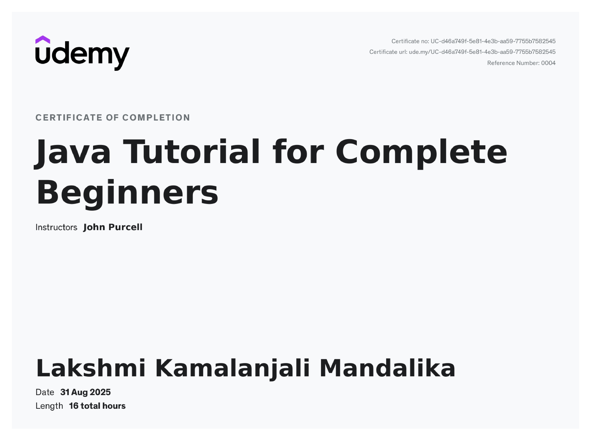

## Hi, I’m Kamalanjali 👋

💻 Software Engineer | Tech Explorer | Lifelong Learner

## 🛠️ Skills

Programming: Java, Python, SQL, JavaScript

Web: HTML, CSS

Databases: MySQL, Oracle

Tools & Platforms: Git, VS Code, Eclipse

## 🏆 HackerRank Badges

  
  
  
  
  

---

## 🎓 Certifications

  <!-- HackerRank -->
  
  
  <!-- Udemy -->
  
  
  <!-- Coursera -->
  

## 📈 What I’m About

🌱 Always learning and exploring new technologies

🚀 Sharpening my core skills in Java, SQL, and JavaScript

🔍 Interested in problem-solving and building impactful projects

☁️ Building a foundation in Cloud Architecture

## 🌐 Connect with Me

  <!-- LinkedIn -->
  
   &nbsp;&nbsp;&nbsp;
  <!-- Gmail -->
  
   &nbsp;&nbsp;&nbsp;
  <!-- GitHub -->
  <a href="https://github.com/YourGitHubUsername" target="_blank">
    <picture>
      <source media="(prefers-color-scheme: dark)" srcset="https://raw.githubusercontent.com/edent/SuperTinyIcons/master/images/svg/github.svg" />
      <source media="(prefers-color-scheme: light)" srcset="https://raw.githubusercontent.com/edent/SuperTinyIcons/master/images/svg/github.svg" />
      
    </picture>
  </a>
   &nbsp;&nbsp;&nbsp;
  <!-- HackerRank -->
  

##

⚡ **_Curious mind. Clean code. Constant growth._**
